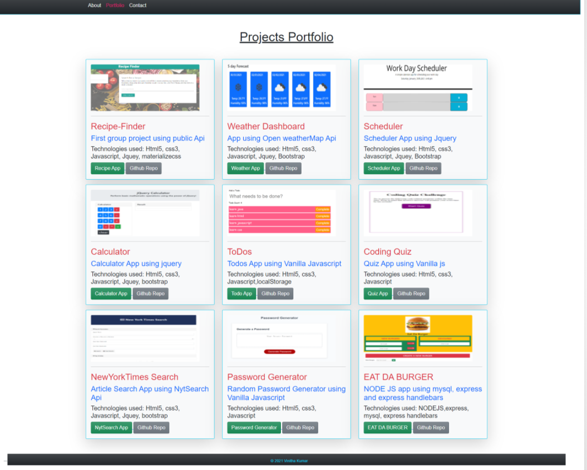

# Portfolio
created and updated my portfolio with the link to my latest projects and my github repo.
Updated my contact details and added my resume in pdf format with the downlaodable link.
The site is very responsive on al view ports

## Mockup
### About me page

----------------------------------------------------------------------------------------------------
-------------------------------------------------------------------------------------------------------
----------------------------------------------------------------------------------------------------
### Portfolio page

---------------------------------------------------------------------------------------------------------------------------------------------------------------------------------------------------------------------------------------------------------------------------------------------------------------------------------------------------------
### Contact page

[gitHub link](https://selvivini.github.io/Portfolio/)
